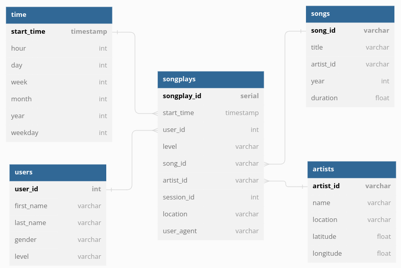

## Udacity Data Engineering Nanodgree - Naomi Munro
# Project 1: Data Modeling with Postgres

This project models song play data for a fictional music streaming company, *Sparkify*. It stores song and user log data in a database, ***sparkifydb***, using star topology with fact and dimension tables. The original data comes from json files and is then processed and inserted into the following schema.



The Extract, Transform, Load pipline in `etl.py` processes data from the song and log files and inserts it into the database. Data from the `data/song_data` files is loaded into the dimension tables ***songs*** and ***artists***. Data from the `data/log_data` files is loaded into the dimension tables ***time*** and ***users***. A select query is used to combine data from the ***songs*** and ***artists*** with data from the user log files to populate the fact table ***songplays***. This select relies on a foreign key from songs to artists which is not shown in the above diagram.

### File descriptions
**sql_queries.py** - Defines the `DROP`, `CREATE`, `INSERT` and `SELECT` statements for the sparkify database schema.  
**create_tables.py** - Connects to the Postgres database and runs the `DROP` and `CREATE` statements that are defined in sql_queries.py.  
**test.ipynb** - A python notebook that runs simple tests to check the schema and data.  
**etl.ipynb** - The python notebook that I used to explore the data and write and test the code.  
**data\song_data** - A directory containing the json song data files.  
**data\log_data** - A directory containing json log files of user actions, e.g. next song, logout.  
**etl.py** - The Extract, Transform and Load pipeline. This script loads the data from the song and log files, processes it and inserts it into the database.  
**README.md** - This file.  
**db_entity_diagram.png** - The png image of the schema tables and their relationships that is embedded in this readme file.  

### Running the files

First, create the database and queries by running create_tables.py:

```bash
root@86ae7300c3ca:/home/workspace# python create_tables.py
```
    
Then run the etl script:
```bash
root@86ae7300c3ca:/home/workspace# python etl.py
```
The output should look like the following:
```
72 files found in data/song_data
1/72 files processed.
2/72 files processed.
...etc...
71/72 files processed.
72/72 files processed.
30 files found in data/log_data
1/30 files processed.
2/30 files processed.
...etc...
29/30 files processed.
30/30 files processed.
```

### Example queries of song play analysis

Some example queries that could be used to analyse this data.

#### Number of users that listened to songs on the 21st of November 2018

`SELECT count(*) FROM songplays JOIN time ON songplays.start_time = time.start_time WHERE time.year = 2018 AND time.month = 11 AND time.day = 21`

Example output:

```
count 
-------
   437
(1 row)
```

#### Count of total users
`SELECT count(*) FROM users`

Example output:
```
 count 
-------
    96
(1 row)
```

#### List of songs that were played on the 21st of November 2018 between 21:00 and 22:00
`SELECT songs.title FROM songplays JOIN time ON songplays.start_time = time.start_time JOIN songs ON songplays.song_id = songs.song_id WHERE time.year = 2018 AND time.month = 11 AND time.day = 21 AND time.hour >= 21 and time.hour < 22`

Example output:
```
     title      
----------------
 Setanta matins
(1 row)
```